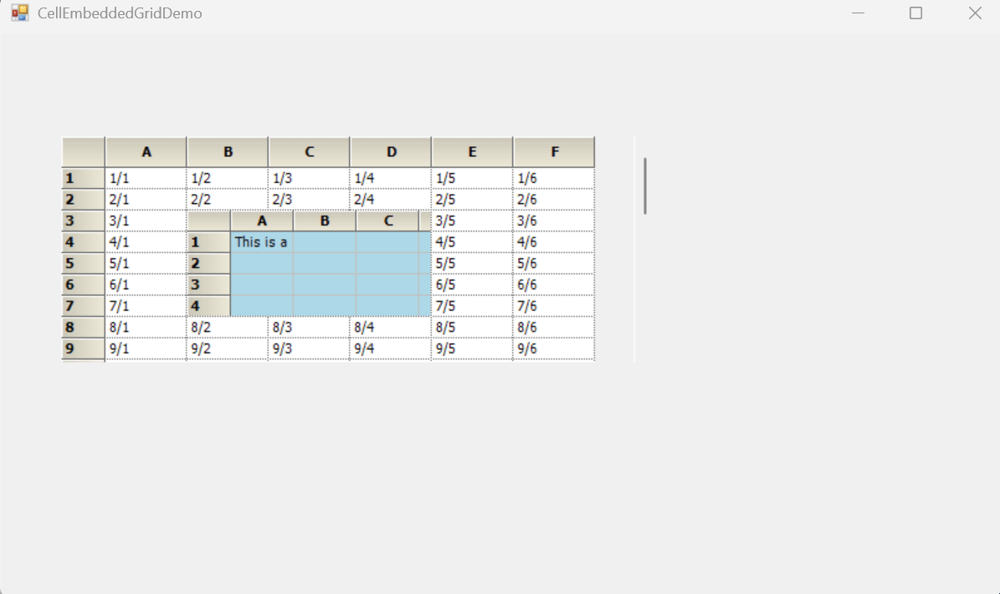

# How to enable mouse scrolling for EmbeddedGrid when hovering over embedded GridControl?

In [WinForms GridControl](https://www.syncfusion.com/winforms-ui-controls/grid-control), scrolling for an [CellEmbeddedGrid](https://help.syncfusion.com/cr/windowsforms/Syncfusion.GridHelperClasses.CellEmbeddedGrid.html) is enabled based on mouse hover by detecting the cursor position and redirecting focus to the embedded grid using [CellMouseHover](https://help.syncfusion.com/cr/windowsforms/Syncfusion.Windows.Forms.Grid.GridControlBase.html#Syncfusion_Windows_Forms_Grid_GridControlBase_CellMouseHover)  event. Within the [VScrollPixelPosChanging](https://help.syncfusion.com/cr/windowsforms/Syncfusion.Windows.Forms.Grid.GridControlBase.html#Syncfusion_Windows_Forms_Grid_GridControlBase_VScrollPixelPosChanging) event scrolling of the parent grid is restricted when the mouse hovers over the embedded grid by setting e.cancel to true. This ensures that scrolling within the embedded grid does not affect the parent grid, resulting in smooth scrolling within the embedded grid.
 
 ```csharp
//Events subscription 
gridControl1.CellMouseHover += OnCellMouseHover;
gridControl1.VScrollPixelPosChanging += OnVScrollPixelPosChanging;
embeddedGrid.MouseHover += EmbeddedGrid_MouseHover;

//Events customization
private void EmbeddedGrid_MouseHover(object sender, EventArgs e)
 {
     ParentGridScrollBarValue = gridControl1.VScrollBar.Value;
 }

 private void OnVScrollPixelPosChanging(object sender, GridScrollPositionChangingEventArgs e)
 {
     GridControl grid = sender as GridControl;
     Point clientPt = grid.PointToClient(Control.MousePosition);
     if (grid.PointToRowCol(clientPt, out int row, out int col, -1))
     {
         var covered = grid.CoveredRanges?.FindRange(row, col);
         if (covered != null && grid.CoveredRanges.Count > 0) { row = covered.Top; col = covered.Left; }
         GridControl target = grid[row, col].Control as GridControl;
         if (target != null && target.IsHandleCreated && target.Visible && target.VScroll)
         {
             gridControl1.VScrollBar.Value = ParentGridScrollBarValue;
             e.Cancel = true;
         }
     }
 }

 private void OnCellMouseHover(object sender, GridCellMouseEventArgs e)
 {
     GridControl grid = sender as GridControl;
     if (grid[e.RowIndex, e.ColIndex].Control is CellEmbeddedGrid)
         grid.CurrentCell.MoveTo(e.RowIndex, e.ColIndex);
 } 
 ```

 

Take a moment to peruse the [WinForms GridControl - Scrolling](https://help.syncfusion.com/windowsforms/grid-control/scrolling) documentation, to learn more about scrolling with examples.